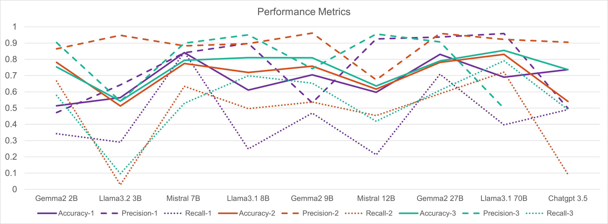
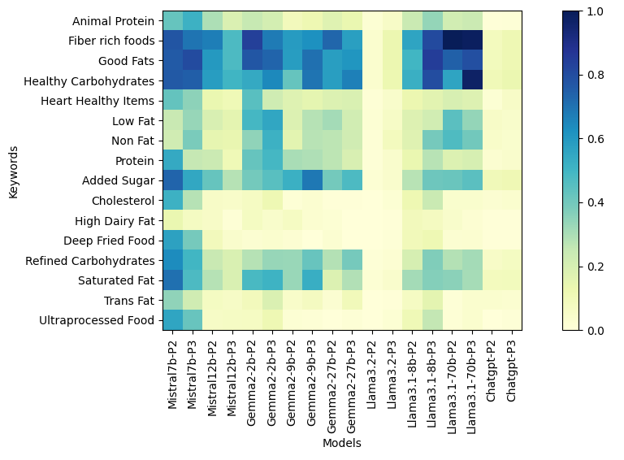
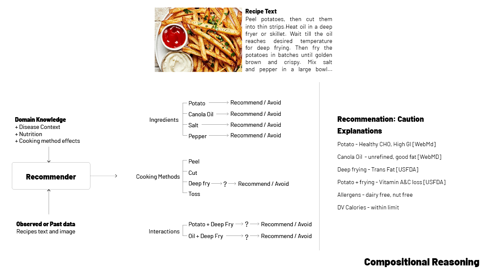

## Nourich: Disease Specific Diet Management System
Objective: The goal of the system is to analyze whether a given recipe is suitable for specific chronic conditions (diabetes) or not. In addition, the system aims to provide alternative recipes or a revised recipe through ingredient and cooking method substitutions. 

Challenges: Analyzing recipe suitability for diabetes involves investigating the suitability of ingredients, cooking methods, and their interactions. This requires structured presentation from unstructured data (e.g., natural language, images) to draw individual inferences on the suitability of ingredients, cooking methods, and their interactions. This requires compositional reasoning, where the problem is broken into sub-problems, drawing individual inferences, and is combined to form a final decision on suitability. Analyzing the suitability of these individual components requires contextual knowledge, such as nutrition, disease-specific guidelines, glycemic index, and cooking method effects with low-level data elevated to high-level concepts (e.g., "potato is a healthy carbohydrate"). Although general generative models are trained on extensive data, extracting disease-specific dietary constraints from their embedding space and establishing relationships between concepts to draw inferences remains a significant challenge \cite{}. In such high-stakes domains, incorrect recommendations can be harmful, so the model must explain the reasons and also trace its reasoning to trusted knowledge sources.

#### C3AN for Nourich
We propose Nourich, a disease specific diet management system designed to offer personalized dietary recommendations to individuals with specific constraints as described in Figure \ref{}. Such complex challenges of the domain and its objective requires a comprehensive framework like C3AN to ensure safe and trustworthy AI systems whose outputs can be relied on to take a decisive action.

* Composite orchestration: Nourich system requires following steps to analyze the suitability of the recipes as follows (i) recipe image to recipe text generation model (ii) ingredient extraction from recipe text as per usage order (iii) cooking method extraction from recipe text (iv) relationship extraction between ingredients and cooking methods from recipe text (for example, mix:[salt, pepper], grill:[steak]) (v) map ingredient and cooking method names of recipes to the names in the knowledge base to gather suitability reasons with in the context of health conditions (for example, potato $\rightarrow$ healthy carbohydrate $\rightarrow$ recommend, sour cream $\rightarrow$ high fat $\rightarrow$ avoid) (vi) based on these individual inferences, compositionally reason and present the overall suitability of the recipe with explanations. Small scale specific models are implemented to execute each task where models are required to learn only specific patterns. This sequential modular workflow also allows for replacing components as necessary and ensures greater flexibility, easier error detection, and efficient adaptation to new requirements or improvements without disrupting the entire system.

* Custom Workflow: Nourich is trained using only the data and knowledge that are directly relevant to the task at hand, ensuring a highly tailored and efficient approach. This custom workflow significantly reduces the need for large, resource-intensive language models (LLMs), which typically require substantial computational resources for training and operation. By focusing on domain-specific information, Nourich is able to achieve high performance without the overhead associated with general-purpose LLMs, making it more accessible and scalable for deployment on devices with limited hardware capabilities.

* Compact Focus: Mission-critical enterprise applications are prevalent not only in organizations with substantial computational resources but also across various industries. This underscores the necessity of developing applications and systems that can operate effectively on modest hardware configurations, ensuring accessibility to a broader user base. In the case of Nourich, it is essential for these models to be deployable on mobile devices, enabling users to capture images of food and query its suitability in the context of diabetes.

* Neurosymbolic AI: In high-stakes domains, where incorrect outputs could have detrimental consequences, end-to-end embedding-based models may not be suitable. Embeddings, being approximation vectors that map words into embedding spaces, inherently involve information loss due to their approximative nature. Consequently, errors can arise, and when compounded within a complex pipeline, the magnitude of these errors can escalate. Therefore, there is a critical need for neurosymbolic models, where neural components are responsible for pattern recognition, and symbolic components support decision-making, ensuring greater accuracy and reliability. The 14 foundational elements ensure trustworthy AI systems while neurosymbolic nature facilitates development of these 14 elements. The necessity of 14 foundational elements are described in Table \ref{tab:14features}.

The system incorporates several types of knowledge to enhance recipe analysis. Taxonomy refers to the hierarchical relationships among entities, where cooking methods and ingredient categories are organized in a structured manner. Causal knowledge captures the effects of specific events, such as how grilling meat produces carcinogens. Logical Constructs are curated for recipe analysis, where rules like "if an ingredient is high in cholesterol, it is unsuitable for diabetes" help guide decision-making. Furthermore, the system uses Rules to infer implicit knowledge, such as the rule that if the carbohydrate-to-fiber ratio of an ingredient is 10:1, it can be classified as a whole grain, suitable for diabetes; otherwise, it is not considered whole grain. Such variety of knowledge incorporation also demonstrates the need for neurosymbolic systems.

### Results: C3AN vs LLMs
#### C3AN: Knowledge Graph based Bayesian vs other baselines

| Method           | Accuracy (Equal Weight) | Precision (Equal Weight) | Recall (Equal Weight) | Accuracy (Relative Weight) | Precision (Relative Weight) | Recall (Relative Weight) |
|------------------|-------------------------|--------------------------|-----------------------|----------------------------|-----------------------------|--------------------------|
| Random           | 0.4832                  | 0.4845                   | 0.4819                | 0.4832                     | 0.4845                      | 0.4819                   |
| MRH              | 0.4588                  | 0.4616                   | 0.4782                | 0.4588                     | 0.4616                      | 0.4782                   |
| NWMRH            | 0.6109                  | 0.5940                   | 0.7072                | 0.5006                     | 0.5030                      | 0.3258                   |
| IFMRH            | 0.5040                  | 0.5027                   | 0.9997                | 0.4865                     | 0.4937                      | 0.9591                   |
| LRLW             | 0.5101                  | 0.5058                   | 0.9920                | 0.4515                     | 0.4723                      | 0.8041                   |
| SALW             | 0.7855                  | 0.7233                   | 0.9265                | 0.5950                     | 0.5990                      | 0.5800                   |
| Neural Network   | 0.8908                  | 1.0000                   | 0.8908                | 0.9021                     | 1.0000                      | 0.9021                   |
| Bayesian         | 0.9478                  | 0.9405                   | 0.9607                | 0.9439                     | 0.9411                      | 0.9518                   |

Table above compares the performance of various baselines against the Neurosymbolic Knowledge Graph based Bayesian Recommendation Method, specifically Bayesian inference for Recipe Suitability Analysis for Diabetes. The evaluation used two weighting schemes: All Ingredients with Equal Weight and Relative Ingredient Weight, and standard classification metrics such as accuracy, precision, and recall. The Majority Rule Heuristic (MRH) showed the lowest performance, with accuracy lower than the random method. Normalized weighting in the Normalized Weighted Majority Rule Heuristic (NWMRH) improved recall but led to a significant drop under relative ingredient weights. Both the Inverse Frequency Weighted Majority Rule Heuristic (IFMRH) and Logistic Regression Learned Weights (LRLW) showed high recall but lower accuracy, suggesting a bias toward predicting recipes as suitable. Self-Attention Learned Weights (SALW) achieved a balanced performance with improvements in accuracy and recall. Neural Networks performed well in accuracy and recall under equal weighting, but precision dropped with relative ingredient weights.

The Bayesian model outperformed all methods, achieving the highest accuracy, precision, and recall, and remained robust under relative ingredient weighting, demonstrating its ability to capture ingredient interactions effectively. However, inaccuracies in text extraction from recipe websites, such as misinterpreting ingredient quantities, slightly affected performance. The distinction between Bayesian models and neural networks lies in how they handle uncertainty and reasoning. Bayesian models manage probability distributions, offering transparent reasoning, while neural networks rely on learned representations with less interpretability. In this research, the Bayesian approach was more advantageous, as its structured probabilistic modeling was critical for recipe suitability analysis. The results highlight that Bayesian inference provides more reliable recommendations, whereas neural networks, though powerful, lack the structured decision-making process that Bayesian models offer.

#### Investigating the ability of LLMs to analyze recipe suitability for diabetes
Nine LLMs were chosen to investigate the ability of LLMs to analyze recipe suitability for diabetes. Three different kinds of prompts were used for the analysis

##### 1. Direct Query Prompt (Prompt-1)
In this approach, a straightforward, single-line query is presented alongside the recipe. This aims to evaluate whether LLMs can recognize that the query pertains to a diabetes-specific diet and retrieve relevant medical guidelines from their vast embedding space learned during their training to analyze meals by reasoning over recipe contents. This refers to *medical knowledge retrieval*.

> **Prompt Example:**
>
> *Give one word Answer YES/NO.*  
> *Is the Given Recipe safe for diabetes?*  
> *The Title of the Recipe is:*  
> \{recipe title\}  
> *The Ingredients of \{recipe title\} are:*  
> \{comma-separated list of ingredients\}.  
> *The Instructions of \{recipe title\} are:*  
> \{list of instructions\}

##### 2. Context Guided Prompt (Prompt-2)
This prompt incorporates explicit dietary guidelines. The model uses this knowledge instead of retrieving from its search space. This requires *conceptual understanding* of healthy carbohydrates, saturated fats, and other dietary concepts. This is essential to apply the knowledge to individual recipe ingredients to analyze their suitability. The guidelines were curated from [MayoClinic](https://www.mayoclinic.org/healthy-lifestyle/nutrition-and-healthy-eating/in-depth/low-glycemic-index-diet/art-20048478) and [NIDDK](https://www.niddk.nih.gov/health-information/diabetes). This also evaluates if LLMs prioritize the external knowledge provided over its internal knowledge.

> **Prompt Example:**
>
> *You will be given a recipe with title, list of ingredients, and instructions to make the recipe. You will also be given dietary guidelines for diabetes that tell items to recommend and avoid. Based on this information, tell me in one word if the recipe is suitable for diabetes using YES or NO options. Then provide 2-3 lines of reasoning along with YES or NO as to why the recipe is suitable or not suitable using those keywords in the given dietary guidelines.*  
> 
> **Recipe Title:** \{add recipe title\}  
> **Recipe Ingredients:** \{list of ingredients separated by commas\}  
> **Recipe Instructions:** \{a paragraph of instructions\}  
> 
> **Diabetes Dietary Guidelines:**  
> For diabetes, the recommended items are:  
> (i) Healthy Carbohydrates  
> (ii) Fibre-rich foods  
> (iii) Heart Healthy fish  
> (iv) Good Fats  
> (v) Animal Protein  
> (vi) Protein  
> (vii) Non-fat, Low-fat items  
> 
> The items that should be avoided are:  
> (i) Saturated fat  
> (ii) High dairy fat  
> (iii) Animal protein  
> (iv) Trans fat  
> (v) Cholesterol  
> (vi) Added sugar  
> (vii) Refined/processed carbohydrates  
> (viii) Ultra-processed foods  
> (ix) Deep-fried foods

##### 3. Exemplary Context Prompt (Prompt-3)
This prompt is an enhanced version of the Context Guided Prompt that includes specific examples for dietary concepts. For example, vegetables are included as examples of healthy carbohydrates within the prompt without explicitly labeling whether an ingredient is a vegetable. Categories such as saturated fats include direct examples like butter, beef, and sausages. This prompt assesses how effectively LLMs can perform *deductive analysis*, such as deducing that carrot is a vegetable and vegetables are healthy carbohydrates. Further, this evaluation seeks to determine whether the explicit inclusion of such comprehensive information enhances the LLMs' performance.

> **Prompt Example:**
>
> *You will be given a recipe with title, list of ingredients, and instructions to make the recipe. You will also be given dietary guidelines for diabetes that tell items to recommend and avoid. Based on this information, tell me in one word if the recipe is suitable for diabetes using YES or NO options. Then provide 2-3 lines of reasoning along with YES or NO as to why the recipe is suitable or not suitable using those keywords in the given dietary guidelines.*  
> 
> **Recipe Title:** \{add recipe title\}  
> **Recipe Ingredients:** \{list of ingredients separated by commas\}  
> **Recipe Instructions:** \{a paragraph of instructions\}  
> 
> **Diabetes Disease Context:**  
> For diabetes, the recommended items are:  
> (i) Healthy Carbohydrates such as fruits, vegetables, whole grains, legumes, and non-fat dairy  
> (ii) Fibre-rich foods such as fruits, vegetables, nuts, legumes, and whole grains  
> (iii) Heart-Healthy fish such as salmon, tuna, mackerel, and sardines  
> (iv) Good Fats such as avocado, nuts, olive oil, canola oil, and peanut oil  
> (v) Animal Protein such as lean meat, chicken without skin, turkey without skin, fish, and eggs  
> (vi) Protein such as nuts, peanuts, dried beans, chickpeas, split peas, and tofu  
> (vii) Non-fat, Low-fat items such as milk, lactose-free milk, yogurt, and cheese  
> 
> The items that should be avoided are:  
> (i) Saturated fats such as fatty meat, pork, eggs, palm oil, coconut oil, and red meat  
> (ii) High dairy fat such as butter  
> (iii) Saturated fat, animal protein such as beef, hot dogs, sausage, and bacon  
> (iv) Trans fat such as processed snacks, baked goods, shortening, stick margarine, refrigerated doughs, pastries, cookies, crackers, pies, and stick butter replacements  
> (v) Cholesterol such as high-fat dairy, high-fat animal protein, egg yolks, liver, organ meat  
> (vi) Added sugar such as soda, sports drinks, energy drinks, candy, canned fruits, jams, jellies, and ice cream  
> (vii) Refined/processed carbohydrates such as white bread, pasta, juice, sweets, candy, cake  
> (viii) Ultra-processed foods such as hot dogs, fried fish sticks, and fast food burgers  
> (ix) Deep-fried foods such as potato fries and chicken nuggets  

---

##### Results

  <figure style='display: table'>
  
  

    Figure 1:.
  

</figure>

Mistral 7B and Llama3.1 70B exhibit consistent performance with minimal variation between precision and recall across all prompts compared to other models. Mistral-7B performed well in Direct Query Prompt, and Llama3.1-70B in Context Guided Prompt and Exemplary Prompt. Llama3.1 8B, a medium-sized model also seems to have benefited from Exemplary Context Prompt. While most Gemma2 class models have high precision, the recall is low. As shown in Figure \ref{fig:chart_metrics}, recall (dotted line) tends to be lower than precision (dashed line) across all prompts for most models. This indicates that the LLMs may be biased toward predicting recipes as "not suitable for diabetes" to avoid false positive errors. Consequently, the models appear overly cautious in classifying recipes as "suitable." In this context, the cost of false positives, incorrectly identifying a harmful recipe as safe for diabetes, could have adverse outcomes and the models seem to be aware of it. 

  <figure style='display: table'>
  
  

    Figure 2:
  

</figure>

**Impact of Reasoning on Model Performance and Stability:** In Context Guided Prompt (prompt-2) and Exemplary Context Prompt (prompt-3), models were instructed to justify their decisions using keywords derived from dietary guidelines, such as Healthy Carbohydrates, Trans Fat, Cholesterol, and others. Since dietary guidelines were not incorporated into the Direct Query Prompt (prompt-1), models were not instructed to provide reasoning. Gemma2 27B, a lightweight faster model, was used to extract keywords from the reasoning paragraph provided by LLMs for each recipes. The results showed that models classified a recipe as suitable for diabetes justifying by leveraging keywords from both the "recommend" and "avoid" sections of the guidelines. For example, a model might justify its prediction by stating that a recipe lacks saturated and trans fats, aligning with the "recommend" criteria. Consequently, when the model predicted a positive outcome (suitable), we utilized keywords from the "recommend" section for validation. Conversely, for negative predictions (not suitable), we extracted relevant keywords from the "avoid" section to evaluate the model's rationale.

The heatmap presented in Figure 2 shows Mistral 7B produced the highest amount of diverse dietary guideline keywords in its reasoning. This supports the results presented in Figure 1 where Mistral 7B showed steady results across all prompts with less variation between precision and recall. Llama3.1 70B returned keywords clustered around good fats, healthy carbohydrates, and fibre-rich foods. To correlate better, we computed the average F1-score, average stability score (Equation 1), and the average count of keywords across all prompts for a given model. Figure \ref{fig:keyword_performance} demonstrates that the more keywords produced by the model in its reasoning, the better the F1-score and/or better the stability (less variation between precision and recall). It is to be noted that Gemma2-2B is the model with the second-highest stability score that correlates with the second-highest amount of keywords provided in the reasoning. Llama3.1-70B has the third-highest average of keyword count. ChatGPT and Llama3.2-2B had the least amount of keywords in their reasoning which correlates with lower F1-score. If a model confidently reasons with sufficient concepts from dietary guidelines, the model's stability and performance is better.

### View the Slideshow

Click [here](./Dissertation-ppt-view.pdf) to view the full presentation in PDF format.

### Video of Presentation

